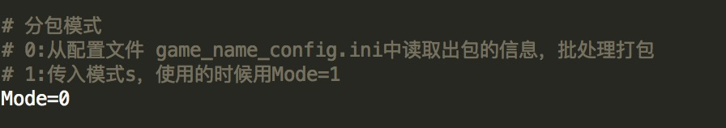
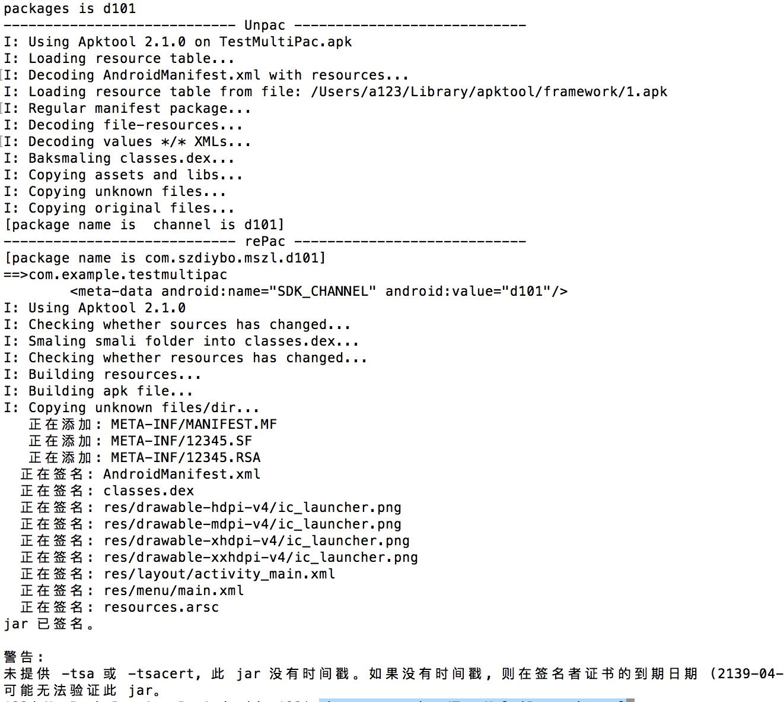
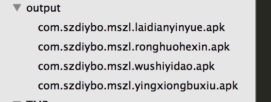
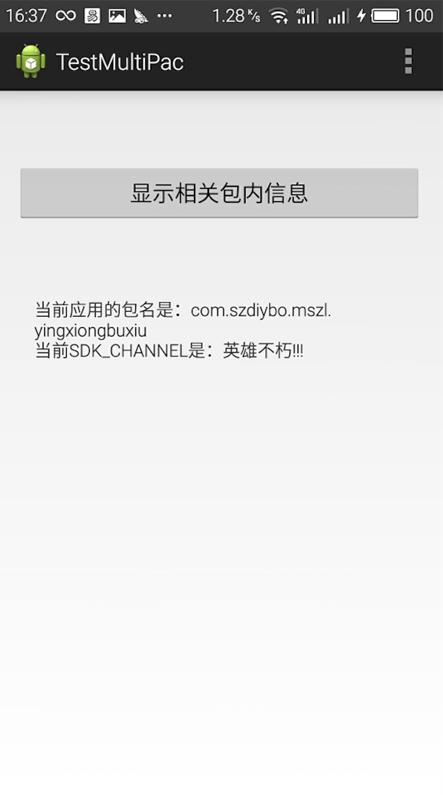

# 一、说明 
## 从产品需求角度

拿到一个apk安装包，然后用这个包去生成n个包，这n个包需要有特定的标示，能够根据包的标示去收集信息，而且这个n个包彼此不能覆盖安装。

## 从技术实现角度
对于这个需求，关键点在于三个点 

1. 实现一个apk生成多个apk 
2. 修改apk中Manifest的一些标示（meta信息）
3. n个包不覆盖安装（修改包名）

## 功能点说明

1. 反编译apk
2. 修改包名和meta信息
3. 重新生成apk包
4. 自动签名

# 二、使用
执行`sh autopac.sh`来看到指令说明。

     ============= Auto pac For game =============
     Version: 1.0
     Date: 20160907
     Usage: Auto repackage For the game, modify package name and subchannel
     e.g.: 
        Mode0: sh autopac.sh inputApkPath gamename
        Mode1: sh autopac.sh inputApkPath gamename channel outputApkPath
            inputApkPath: 待分包的apk路径
            gamename: 游戏名称英文首字母小写
            channel: 渠道号
            outputApkPath: 完成输出apk的路径
     ============= Auto pac For game =============

工具存在两种模式：

第一种）Mode = 1，所有的参数从外部传递调用

第二种）Mode = 0，读取本地的配置文件（common/config目录），可以实现批处理生成多个包

     
**修改模式请在autopac.sh脚本中修改**

# 三、使用截图

**初始包内容**

**执行过程**

**生成结果**

**安装成功**

**随便点开一个包，内容已经修改**

# 四、具体实现请参考Blog

<http://blog.csdn.net/yang8456211/article/details/52513354>
